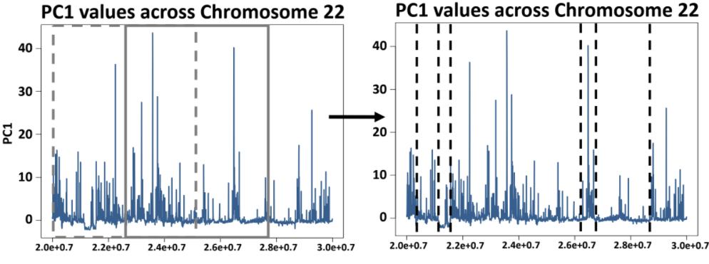
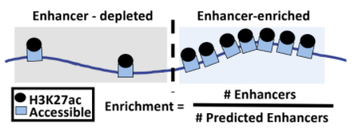
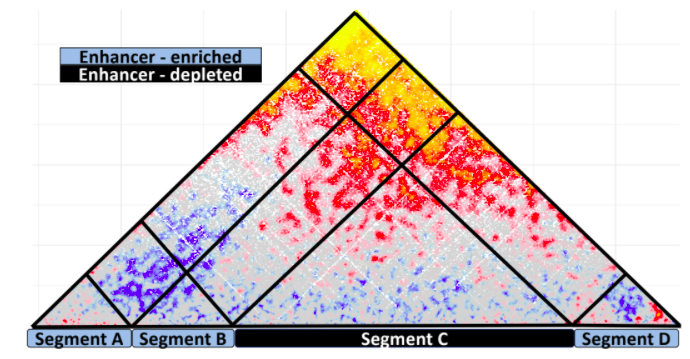

# Prediction of genomic regions participating in the formation of transcriptional condensates

## Introduction

This repository contains scripts related to a computational pipeline that aims to propose genomic regions that participate in the **formation of transcriptional condensates**. 

More details for this pipeline may be found in our paper:  
**"SEGCOND predicts putative transcriptional condensate-associated genomic regions by integrating  multi-omics data"**  
_Antonios Klonizakis, Christoforos Nikolaou and Thomas Graf_

Our methodology aims to identify potential candidate regions participating in the formation and maintenance of biomolecular condensates, using a series of omics experimental outputs, coupled with conformational data such as Hi-C.
 
Regions in the genome participating in putative, transcriptional condensates should exhibit specific characteristics within regards to their protein occupancy, accessibility levels and 3D chromatin contacts. There are several observations being reported or theorized for regions identified as transcriptional condensate. Condensate regions are reported to be co-occupied by multiple transcription factors and high levels of enhancer related marks, while also harboring multiple 3D interactions between gene promoters and regulatory elements.

The proposed methodology consists of three distinct stages and is outlined below:

1. [**Segmentation of the genome**](https://github.com/AntonisK95/SEGCOND/tree/main/SEGCOND_code_and_User_Guide#segmentation)
   Omics-tracks Integration and Genome Segmentation: We integrate multiple omics datasets and through dimensionality reduction and genome segmentation we create a set of distinct genomic segments in linear chromosomes.

    

2. [**Annotation of segments**](https://github.com/AntonisK95/SEGCOND/tree/main/SEGCOND_code_and_User_Guide#annotation)
   Segment Annotation: Each segment is scored and assigned to a different functional class with the focus being on enhancer-associated properties.

   

3. [**Integration of Hi-C data**](https://github.com/AntonisK95/SEGCOND/tree/main/SEGCOND_code_and_User_Guide#hi-c-integration)
   3D interaction between and within segments is scored with the integration of Hi-C data. Candidate regions are identified through the application of a set of thresholds associated with chromosomal interaction values. This step makes use of [SHAMAN](https://github.com/tanaylab/shaman).

    

The scripts that perform the above tasks are written in R. Note that the final step of SEGCOND operates on normalized SHAMAN Hi-C **tracks**. Their generation requires a multi-core unix / linux based system or a SGE (sun grid engine) cluster for distributed computing. Please refer to the guide of [SHAMAN](https://github.com/tanaylab/shaman) for details on how to create such Hi-C **track** files. 

## Installation and User Guide 

The source code of SEGCOND and details on how to implement it are provided in the [**SEGCOND_code_and_User_Guide**](https://github.com/AntonisK95/SEGCOND/tree/main/SEGCOND_code_and_User_Guide)

## Data Reproducibility 

Putative Transcriptional Condensates reported in our paper and all of the intermediate files produced by our analysis are provided in the [**Publication_Data**](https://github.com/AntonisK95/SEGCOND/tree/main/Publication_Data) folder. For more details on the files and for a list of commands that leads to their generation please refer to the [**README.md**](https://github.com/AntonisK95/SEGCOND/tree/main/Publication_Data#code-to-reproduce-our-published-data) file of the same folder. 
